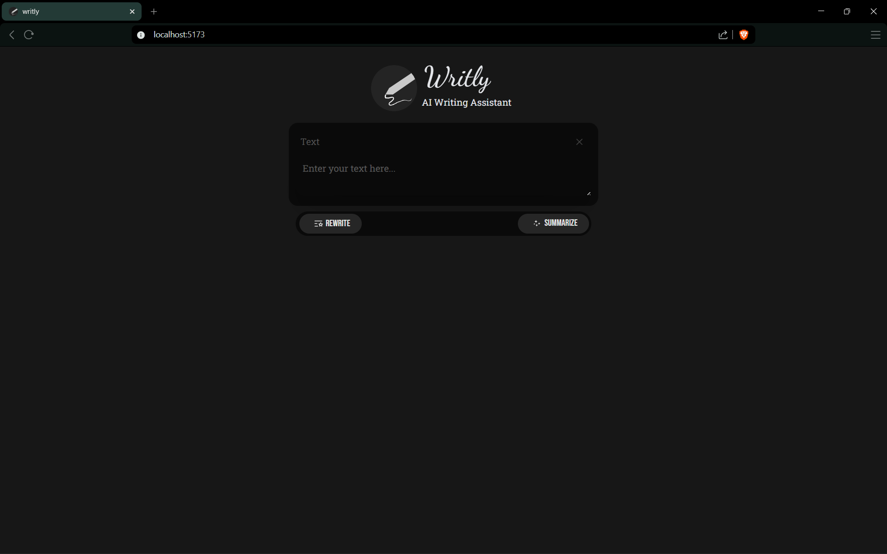
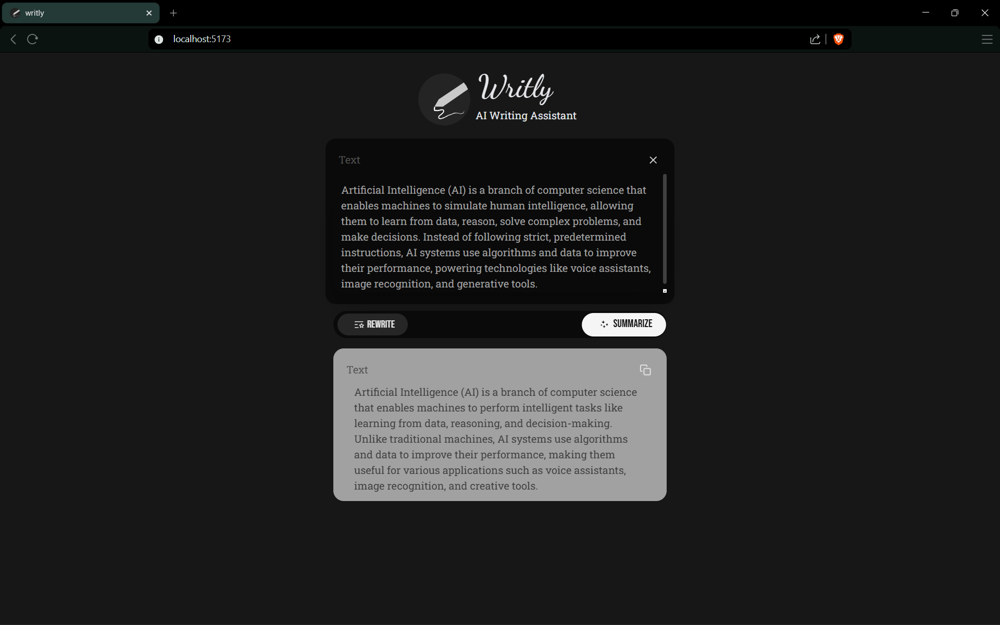

# ✍️ Writly

<p align="center">
  
</p>

<p align="center">
  <b>AI-powered writing assistant to rewrite and summarize text instantly</b>
</p>

---

## 🚀 Features

* ✨ Rewrite text professionally
* 📄 Summarize content into concise points
* ⚡ Fast responses using Groq API
* 📋 Copy output to clipboard
* 🎨 Styled with Tailwind CSS
* 🔤 Clean typography using Google Fonts

---

## 📸 Screenshots

### 🏠 Home Interface



### ✨ AI Output



---

## 🛠️ Tech Stack

### Frontend

* React (Vite)
* Tailwind CSS
* Google Fonts

### Backend

* Node.js
* Express

### AI

* Groq API (LLaMA 3.1)

---

## 📁 Project Structure

```bash
writly/
│
├── backend/
│   ├── server.js
│   ├── package.json
│   └── .env
│
├── frontend/
│   ├── src/
│   ├── public/
│   └── package.json
│
├── assets/
│   └── logo.png
│
├── screenshots/
│   ├── home.png
│   └── output.png
│
└── README.md
```

---

## ⚙️ Setup Instructions

### 1. Clone the repository

```bash
git clone https://github.com/your-username/writly.git
cd writly
```

---

### 2. Setup Backend

```bash
cd backend
npm install
```

Create a `.env` file:

```env
GROQ_API_KEY=your_api_key_here
PORT=5000
```

Run server:

```bash
npm run dev
```

---

### 3. Setup Frontend

```bash
cd frontend
npm install
npm run dev
```

---

## 🌐 API Endpoint

```bash
POST /api
```

### Request Body:

```json
{
  "text": "your text here",
  "type": "rewrite" | "summarize"
}
```

---

## ⚡ Deployment

* Frontend → Vercel
* Backend → Render / Railway

---

## 🧠 Future Improvements

* Tone selection (formal, casual, simple)
* Save history
* Download output
* Authentication

---

## 📄 License

Free to use and modify.

---

## 💡 Author

Built with 💻 by Abhijeet Dewangan. 🚀
